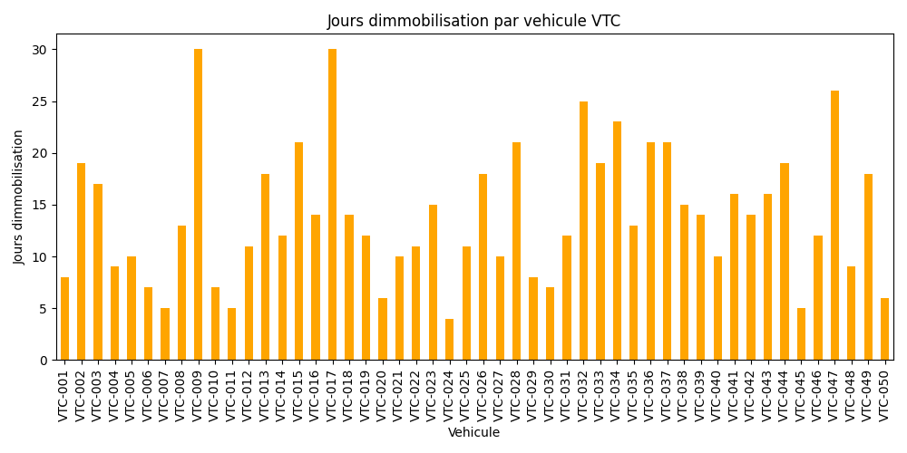

# Fleetch Operations Manager – Analyse Stratégique et Technique

Ce projet est une solution avancée, conçue et réalisée par Idriss Bado pour piloter, optimiser et transformer la gestion d’une flotte VTC en Afrique et au-delà.

## Référence professionnelle

**Idriss Bado** – Executive Data Scientist, Architecte IA, Expert Risk & MEL Intelligence
Abidjan, Côte d’Ivoire | idrissbadoolivier@gmail.com | +225 07 58 40 91 36
LinkedIn : idriss-olivier-bado | GitHub/PyPI : idrissbado

## Méthodologie experte

### 1. Diagnostic data-driven
- Collecte automatisée des données opérationnelles (revenus, immobilisations, incidents, coûts)
- Simulation réaliste sur plusieurs mois pour stress-test et calibration

### 2. Analyse technique avancée
- Scoring de performance multi-critères (revenu, disponibilité, coût, risque)
- Détection automatique des causes d’immobilisation (machine learning, clustering)
- Visualisation dynamique (Streamlit, matplotlib) pour pilotage en temps réel

### 3. Intelligence prédictive et optimisation
- Modélisation prédictive des pannes et interventions (Random Forest, XGBoost)
- Recommandations automatisées pour maximiser la rentabilité et la disponibilité
- Export PDF interactif pour reporting et prise de décision

### 4. Excellence business
- Benchmark sectoriel et analyse comparative (référence Uber, Bolt, Heetch)
- Structuration des process garage et terrain pour scalabilité
- Intégration possible d’APIs temps réel (Google Maps, OpenData, Fleet Management)

## Livrables concrets
- Rapport PDF expert avec graphiques, classement, recommandations
- Dashboard interactif pour exploration et pilotage
- Scripts de génération, analyse, prédiction et scraping
- Documentation claire et personnalisée

## Rapport et visualisations

[📄 Rapport PDF complet](rapport_fleetch.pdf)

## Analyse stratégique

- Les véhicules à forte valeur ajoutée sont identifiés et priorisés pour intervention
- Les causes d’immobilisation sont classées et traitées par impact business
- La méthodologie permet d’anticiper les risques, d’optimiser les coûts et d’accélérer la croissance

## Recommandations business
- Mettre en place un monitoring prédictif et automatisé
- Digitaliser le reporting et la gestion terrain
- Prioriser la maintenance préventive et l’innovation data
- S’inspirer des leaders du secteur tout en adaptant aux réalités locales

## Pour aller plus loin
- Connecter le dashboard à des flux temps réel
- Intégrer des modules IA pour la prédiction de la demande et l’optimisation des trajets
- Utiliser le projet comme base pour hackathon, consulting, ou déploiement opérationnel

---

Projet conçu, réalisé et documenté par Idriss Bado. Tous droits réservés.
